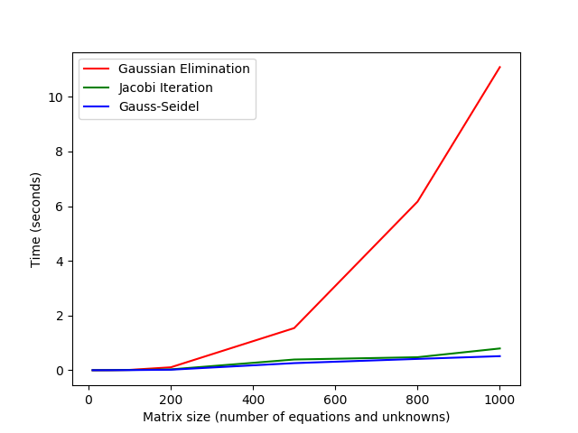

### Seventh task set

1. I compared the time taken on my computer for Gaussian elimination, Jacobi iteration, and Gauss-Seidel to solve linear systems with diagonally dominant coefficient matrices of various sizes. The tolerance for the iterative methods was 1e-6. The results are tabulated below. The times are listed under the names of the algorithm and are in seconds. Note that there are intersections for the Gaussian elimination curve with the Gauss-Seidel and Jacobi curves. For the matrix of size ten, Gaussian elimination outperforms both Jacobi and Gauss-Seidel. For the matrices larger than the 10 tested, both iterative methods always outperform Gaussian elimination. Note that the intersections would occur later if I used a faster implementation of Gaussian elimination. Various different strategies were taken to implement the three different algorithms; therefore, for a better comparison, the routines should be re-implemented to use similar techniques for things such as memory management and use of objects versus raw arrays.

    ```
    | Matrix size | Gaussian Elimination | Jacobi      | Gauss-Seidel |
    |-------------|----------------------|-------------|--------------|
    | 10          | 7.61e-05             | 0.0009113   | 0.000578     |
    | 50          | 0.0030244            | 0.0029411   | 0.001161     |
    | 100         | 0.0123754            | 0.010248    | 0.0048755    |
    | 200         | 0.106681             | 0.0301007   | 0.0184433    |
    | 500         | 1.54027              | 0.391178    | 0.259531     |
    | 800         | 6.16774              | 0.475738    | 0.413726     |
    | 1000        | 11.0862              | 0.795324    | 0.514353     |
    ```
    
    Below is the code that I used to conduct these tests. The A_med_size variable was changed acoording to the test. For the timing methods, I `#`-included `chrono` from the C++ standard library.
    ```
    // Medium tests
    unsigned int A_med_size = 200;
    std::cout << "A_iterative_medium: " << std::endl;
    DenseArray<double>* A_iterative_medium = new DenseArray<double>(A_med_size);
    A_iterative_medium->makeRandomDD(-10.0, 10.0);

    std::cout << "b_iterative_medium for Iterative methods: " << std::endl;
    Vector<double>* b_iterative_medium = new Vector<double>(A_med_size);
    b_iterative_medium->makeRandom(-10.0, 10.0);

    DenseArray<double>* L_itermed = new DenseArray<double>(A_med_size);
    DenseArray<double>* U_itermed = new DenseArray<double>(A_med_size);

    std::cout << "Gaussian Elimination" << std::endl;
    auto geStart = std::chrono::high_resolution_clock::now();
    lu(*A_iterative_medium, *L_itermed, *U_itermed);
    Vector<double> x_ge001 = luSolve(*L_itermed, *U_itermed, *b_iterative_medium);
    auto geEnd = std::chrono::high_resolution_clock::now();
    std::chrono::duration<double> geTime = geEnd - geStart;
    std::cout << "Gaussian Elimination time: " << geTime.count() << std::endl;

    std::cout << "Jacobi" << std::endl;
    auto jsStart = std::chrono::high_resolution_clock::now();
    Vector<double> x_js001 = jacobiSolve(*A_iterative_medium, *b_iterative_medium, 1e-6, 1000);
    auto jsEnd = std::chrono::high_resolution_clock::now();
    std::chrono::duration<double> jsTime = jsEnd - jsStart;
    std::cout << "Jacobi time: " << jsTime.count() << std::endl;

    std::cout << "Gauss-Seidel" << std::endl;
    auto gsStart = std::chrono::high_resolution_clock::now();
    Vector<double> x_gs001 = gaussSeidelSolve(*A_iterative_medium, *b_iterative_medium, 1e-6, 1000);
    auto gsEnd = std::chrono::high_resolution_clock::now();
    std::chrono::duration<double> gsTime = gsEnd - gsStart;
    std::cout << "Gauss-Seidel time: " << gsTime.count() << std::endl;
    ```

2. See problem 1 above
3. I implemented a routine called `steepestDescentSolve` that computes and returns an approximate solution to a linear system of equations using the method of steepest descent. [See my software manual entry](../software_manual/steepestDescentSolve.md).
4. 
5. I implemented a routine called `cg` that computes and returns an approximate solution to a linear system of equations using the conjugate gradient method. [See my software manual entry](../software_manual/cg.md).
6. 
7.  1. Richardson iteration is an iterative method for solving linear systems. The splitting matrix chosen for the iteration is $(1 / \omega)I$ where $\omega$ is a scalar parameter that is chosen so that the iteration converges. Thus, the update step for Richardson iteration is $x_{k+1} = x_k + \omega(b - Ax_k)$. See this article on Richardson iteration at [http://ware.zintegra.com/2011/01/30/modified-richardson-iteration/](http://ware.zintegra.com/2011/01/30/modified-richardson-iteration/).
    2. Successive over-relaxation (SOR) is an iterative method for solving linear systems. SOR is a modified version of Gauss-Seidel iteration. The splitting matrix for SOR is $1/(\omega) D - L$. See the article on Wikipedia about SOR at [https://en.wikipedia.org/wiki/Successive_over-relaxation](https://en.wikipedia.org/wiki/Successive_over-relaxation).
    3. Damped Jacobi method, also known as the weighted Jacobi method is a modified version of Jacobi iteration and can be used to solve linear systems of equations. For this method the splitting matrix is $1/(\omega) D $ where $\omega$ is typically chosen to be equal to 2/3 for standatd Laplacian matrices. See the Wikipedia article at [https://en.wikipedia.org/wiki/Jacobi_method#Weighted_Jacobi_method](https://en.wikipedia.org/wiki/Jacobi_method#Weighted_Jacobi_method) as well as [this stack exchange thread](https://math.stackexchange.com/questions/3181256/weighted-jacobi-method).
8.  1. An incomplete LU factorization (ILU) is a commonly used preconditioner matrix. The incompleteness in the LU factorization typically matches the structure of the original matrix, thus avoiding fill-in. The following article documents the ILU methods available in the Intel Math Kernel Library [https://software.intel.com/en-us/mkl-developer-reference-c-preconditioners-based-on-incomplete-lu-factorization-technique](https://software.intel.com/en-us/mkl-developer-reference-c-preconditioners-based-on-incomplete-lu-factorization-technique).
    2. For symmetric, positive definite matrices, an incomplete Cholesky factor can be used as a preconditioner when using the Conjugate Gradient method. One simplistic way of implemeting the incomplete factorization is to ignore the zero entries in the original matrix A causing the factor to be more sparse and match the structure of A. This article explains how to do this and includes code in FORTRAN for computing the incomplete factorization: [http://computationalmathematics.org/topics/files/IC.html](http://computationalmathematics.org/topics/files/IC.html).
    3. The Sparse Approximate Inverse (SPAI), as the name suggests, finds a sparse matrix that approximates the inverse of a matrix A. This is done by minimizing the Frobenius norm of $AT - I$ to find a sparse matrix $T$ with a predetermined possible sparse structure. See the section of the article on preconditioners on Wikipedia for more details [https://en.wikipedia.org/wiki/Preconditioner#SPAI](https://en.wikipedia.org/wiki/Preconditioner#SPAI).
9. 
10. Jacobi iteration can be used in conjunction with the normal equations to solve the least squares problem. The algorithm is as follows:

```
1. Compute B = A'A and y = A'b
2. Use Jacobi iteration to solve the system Bx = y for x as follows:
    while residual norm is less than a tolerance and k is less than maxiter:
        for i from 0 to n:
            sum = 0
            for j from 0 to n:
                if j is not equal to i:
                    sum += A[i][j] * x[j]
                end if
            end for
            r[i] = b[i] - sum
            x_next[i] = r[i] / A[i][j]
        end for
        x = x_next
    end while
```
